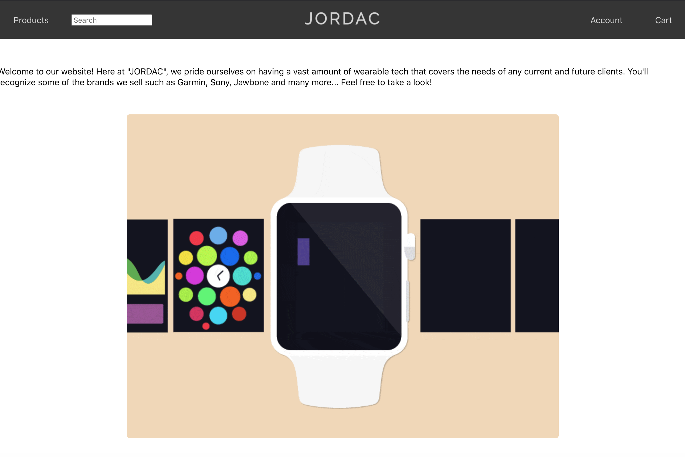
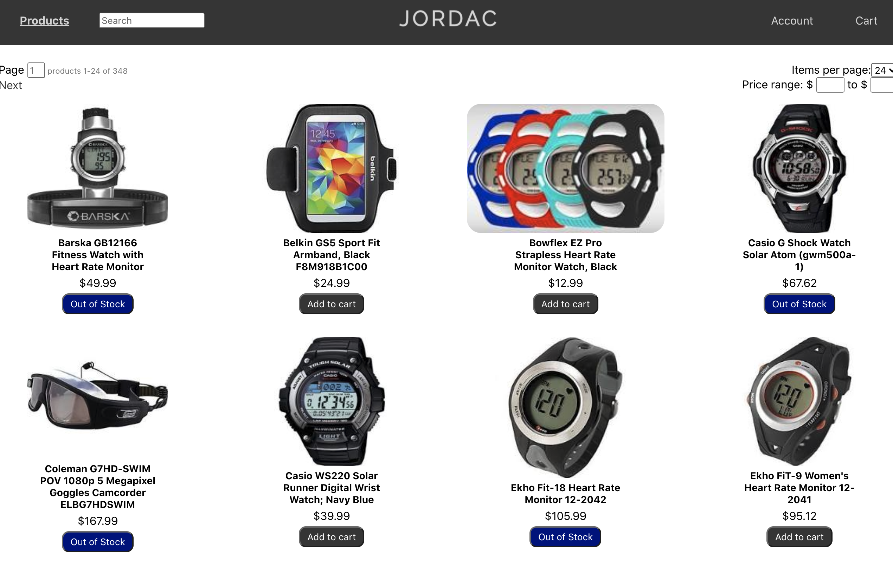
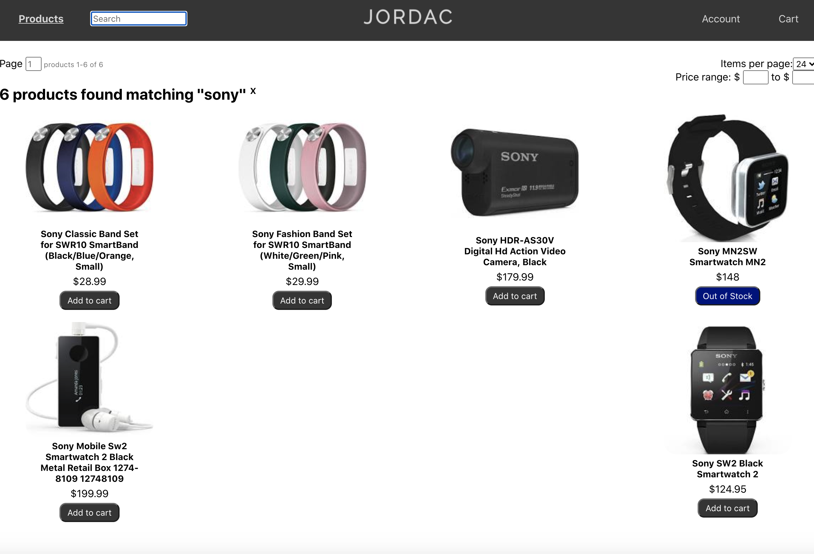
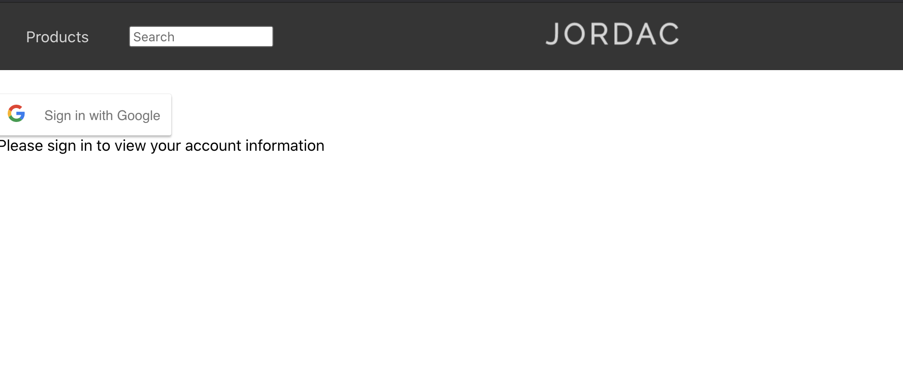
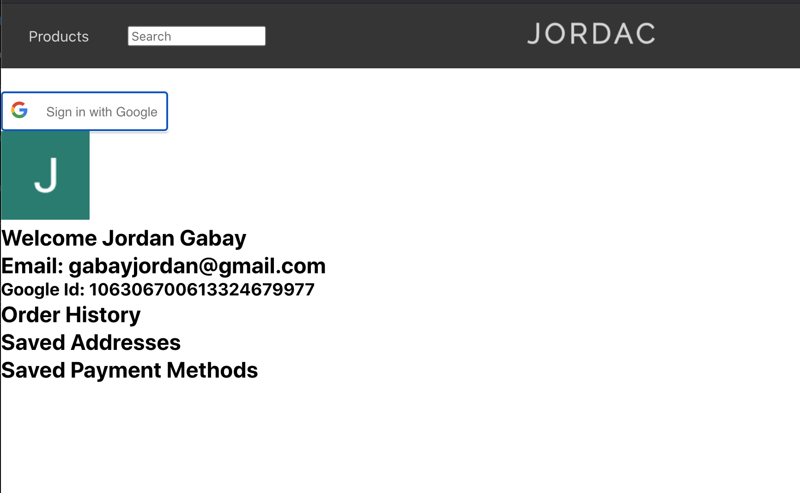
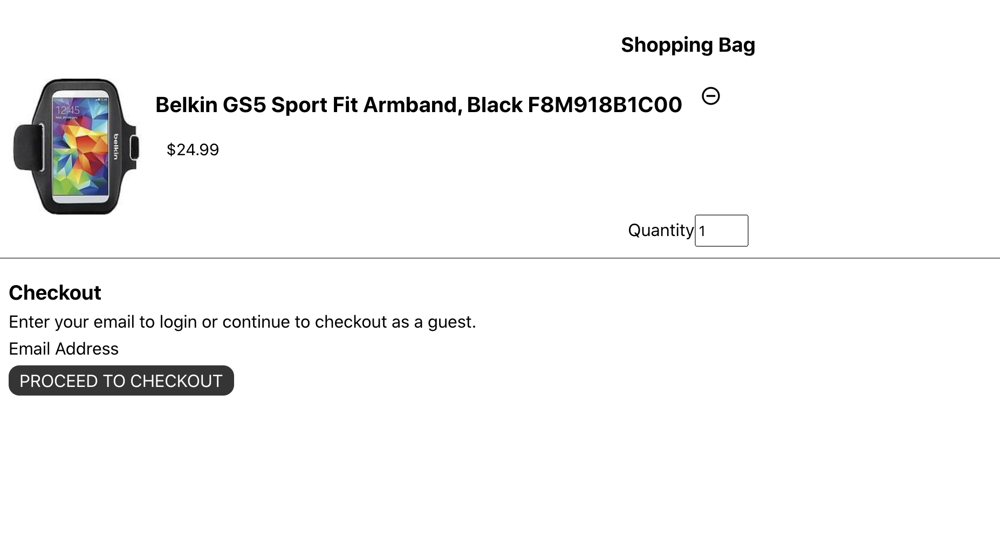
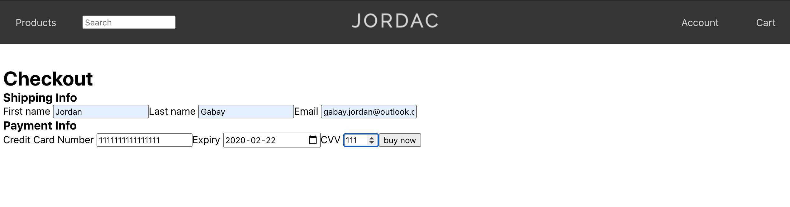
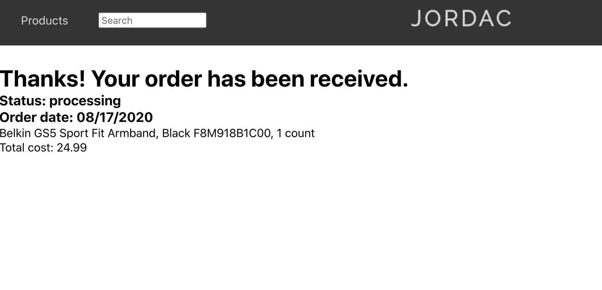

# Wearables E-Commerce Project

This is the updated README doc.

For the project, we have created a wearable online e-commerce store called JORDAC (Jordan and Jackie together).
For the homepage we went with a sleek, casual approach by showing the navbar, a basic description of our company and a gif. Underneath the gif is a NAVLINK to get to the product page, however all of the links on the NavBar are functioning, including the logo name which acts as a return home button.

Homepage: 

We created a products page where all of the products are displayed, however since displaying all of them on one page took so long to load... We created multiple pages for the products. users can use the searchbar to find products by specific companies, changed the amount displayed per page or search by price. Items out of stock cannot be added to the cart.

When users click on the account section, they will be able to use our Google Account sign in authentication so that they can check out with their gmail and this will save their information (able to sign onto the gmail and access it throughout the website but could not get checkout implemented).

Items added to the cart will be displayed in our cart section. The quantity can be updated or the item can be removed. 

We implemented a basic checkout system where users can put their email, card info and other basic information so they can check out securely. 

Finally we have our order confirmation page, it's very basic but it shows the item you purchased and the total you paid. 

